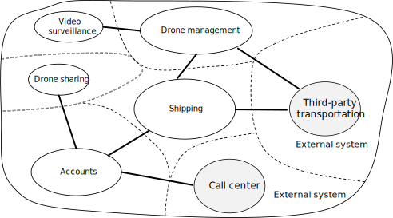
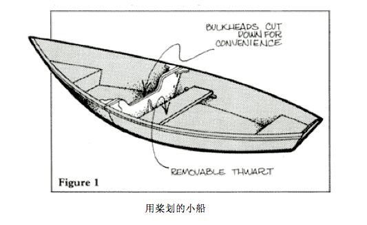
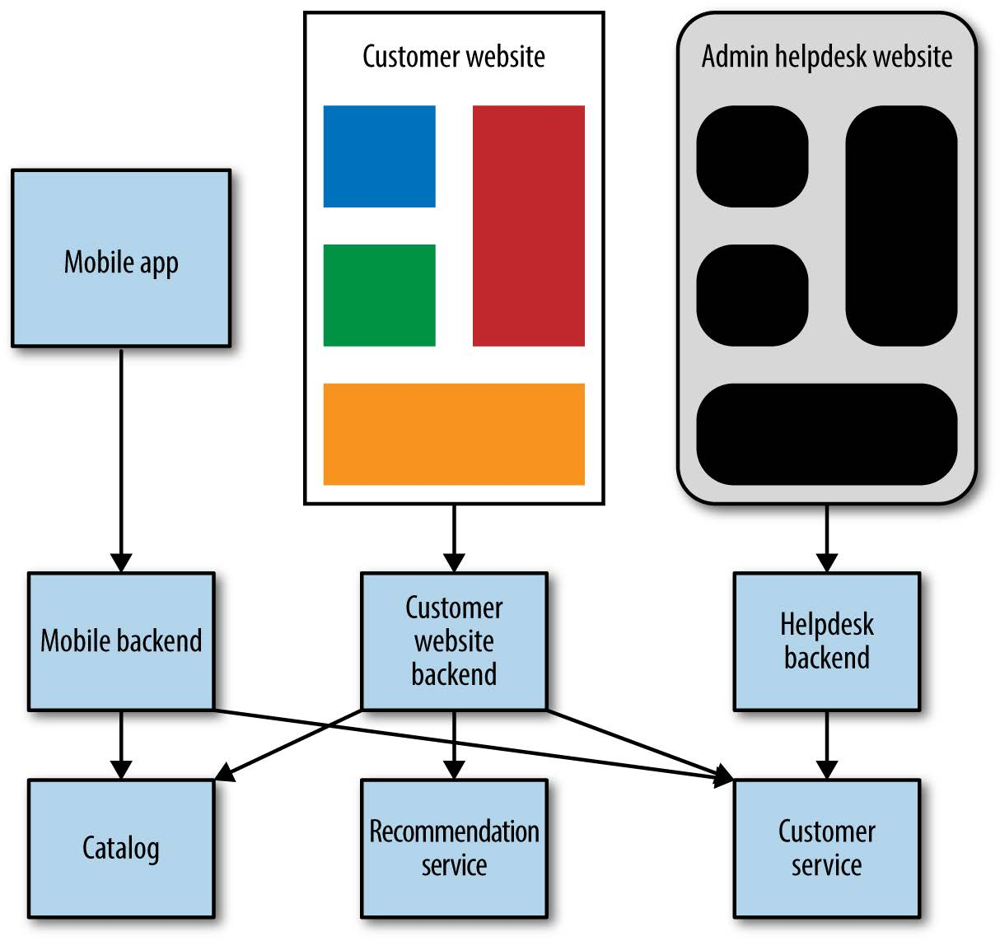
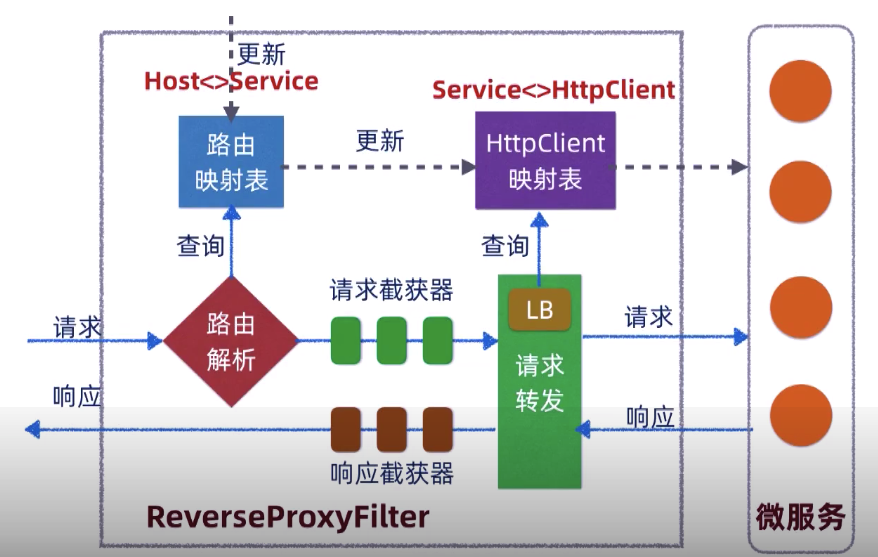

# Building Microservices 1: Service <!-- omit in toc -->

最近读了几本关于如何构建微服务的书，打算用几篇文章分享一下。这篇作为系列的第一篇，主要分享以下几个topic：

- [How to Model Services](#how-to-model-services)
  - [What Makes a Good Services](#what-makes-a-good-services)
  - [Model Around Business Concepts](#model-around-business-concepts)
  - [Scenario: Drone delivery](#scenario-drone-delivery)
  - [Analyze the domain](#analyze-the-domain)
  - [Define bounded contexts](#define-bounded-contexts)
  - [Tactical DDD](#tactical-ddd)
    - [Overview of the tactical patterns](#overview-of-the-tactical-patterns)
    - [Applying the patterns](#applying-the-patterns)
  - [Identifying microservice boundaries](#identifying-microservice-boundaries)
    - [Defining microservices](#defining-microservices)
    - [Validate the design](#validate-the-design)
- [Interservice Communication](#interservice-communication)
  - [Challenges](#challenges)
  - [Sync vs. Async](#sync-vs-async)
    - [Synchronous communication](#synchronous-communication)
    - [Asynchronous message passing](#asynchronous-message-passing)
  - [Distributed transactions](#distributed-transactions)
    - [CAP](#cap)
    - [ACID -> BASE](#acid---base)
  - [Resilient Patterns](#resilient-patterns)
- [API Gateway](#api-gateway)
  - [Gateway Aggregation](#gateway-aggregation)
  - [Gateway Offloading](#gateway-offloading)
  - [Gateway Routing](#gateway-routing)
    - [DNS](#dns)
    - [Dynamic Service Registries](#dynamic-service-registries)
  - [Example: Nginx](#example-nginx)
  - [Example: Zuul](#example-zuul)
  - [Issues and considerations](#issues-and-considerations)
- [Summary](#summary)
  - [Principles of Microservices](#principles-of-microservices)
  - [When Shouldn’t You Use Microservices](#when-shouldnt-you-use-microservices)
  - [Parting Words](#parting-words)
- [Recommended Reading](#recommended-reading)

## How to Model Services

### What Makes a Good Services

- Loose Coupling  
  Microservices are loosely coupled if you can change one service without requiring other services to be updated at the same time.
- High Cohesion  
  A microservice is cohesive if it has a single, well-defined purpose, such as managing user accounts or tracking delivery history. A service should encapsulate domain knowledge and abstract that knowledge from clients. For example, a client should be able to schedule a drone without knowing the details of the scheduling algorithm or how the drone fleet is managed.

### Model Around Business Concepts

Experience has shown us that interfaces structured around business-bounded contexts are more stable than those structured around technical concepts. By modeling the domain in which our system operates, not only do we attempt to form more stable interfaces, but we also ensure that we are better able to reflect changes in business processes easily.

Domain-driven design (DDD) provides a framework that can get you most of the way to a set of well-designed microservices. DDD has two distinct phases, strategic and tactical. In strategic DDD, you are defining the large-scale structure of the system. Strategic DDD helps to ensure that your architecture remains focused on business capabilities. Tactical DDD provides a set of design patterns that you can use to create the domain model. These patterns include entities, aggregates, and domain services. These tactical patterns will help you to design microservices that are both loosely coupled and cohesive.


### Scenario: Drone delivery

Now, let us assume that there is a company called Fabrikam, who's starting a drone delivery service.

- Fabrikam manages a fleet of drone aircraft.
- Businesses register with the service, and users can request a drone to pick up goods for delivery.
- When a customer schedules a pickup, a backend system assigns a drone and notifies the user with an estimated delivery time.
- While the delivery is in progress, the customer can track the location of the drone, with a continuously updated ETA.

This scenario involves a fairly complicated domain. Some of the business concerns include scheduling drones, tracking packages, managing user accounts, and storing and analyzing historical data. Moreover, Fabrikam wants to get to market quickly and then iterate quickly, adding new functionality and capabilities. The application needs to operate at cloud scale, with a high service level objective (SLO). Fabrikam also expects that different parts of the system will have very different requirements for data storage and querying. All of these considerations lead Fabrikam to choose a microservices architecture for the Drone Delivery application.

### Analyze the domain

After some initial domain analysis, the Fabrikam team came up with a rough sketch that depicts the Drone Delivery domain.


- **Shipping** is placed in the center of the diagram, because it's core to the business. Everything else in the diagram exists to enable this functionality.
- **Drone management** is also core to the business. Functionality that is closely related to drone management includes drone repair and using predictive analysis to predict when drones need servicing and maintenance.
- **ETA analysis** provides time estimates for pickup and delivery.
- **Third-party transportation** will enable the application to schedule alternative transportation methods if a package cannot be shipped entirely by drone.
- **Drone sharing** is a possible extension of the core business. The company may have excess drone capacity during certain hours, and could rent out drones that would otherwise be idle. This feature will not be in the initial release.
- **Video surveillance** is another area that the company might expand into later.
- **User accounts**, **Invoicing**, and **Call center** are subdomains that support the core business.

### Define bounded contexts

A bounded context is simply the boundary within a domain where a particular domain model applies. Looking at the previous diagram, we can group functionality according to whether various functions will share a single domain model.



### Tactical DDD

The tactical patterns are applied within a single bounded context. In a microservices architecture, we are particularly interested in the entity and aggregate patterns. Applying these patterns will help us to identify natural boundaries for the services in our application. As a general principle, a microservice should be no smaller than an aggregate, and no larger than a bounded context.

#### Overview of the tactical patterns


- **Entities.** An entity is an object with a unique identity that persists over time. For example, in a banking application, customers and accounts would be entities.
- **Value objects.** Typical examples of value objects include colors, dates and times, and currency values.
- **Aggregates.** An aggregate defines a consistency boundary around one or more entities. Exactly one entity in an aggregate is the root. Lookup is done using the root entity's identifier. Any other entities in the aggregate are children of the root, and are referenced by following pointers from the root. The purpose of an aggregate is to model transactional invariants.
- **Domain services.** Domain services are stateless operations across multiple aggregates. A typical example is a workflow that involves several microservices. We'll see an example of this in the Drone Delivery application.
- **Domain events.** Domain events can be used to notify other parts of the system when something happens. As the name suggests, domain events should mean something within the domain. For example, "a record was inserted into a table" is not a domain event. "A delivery was cancelled" is a domain event.

#### Applying the patterns

We start with the scenarios that the **Shipping bounded context** must handle.

- A customer can request a drone to pick up goods from a business that is registered with the drone delivery service.
- The sender generates a tag (barcode or RFID) to put on the package.
- A drone will pick up and deliver a package from the source location to the destination location.
- When a customer schedules a delivery, the system provides an ETA based on route information, weather conditions, and historical data.
- When the drone is in flight, a user can track the current location and the latest ETA.
- Until a drone has picked up the package, the customer can cancel a delivery.
- The customer is notified when the delivery is completed.
- The sender can request delivery confirmation from the customer, in the form of a signature or finger print.
- Users can look up the history of a completed delivery.

From these scenarios, the development team identified the following relations.


### Identifying microservice boundaries

#### Defining microservices


***Non-functional requirements*** led the team to create two additional service:

- Ingestion service
- Delivery History Service

#### Validate the design

- Each service has a single responsibility.
- There are no chatty calls between services. If splitting functionality into two services causes them to be overly chatty, it may be a symptom that these functions belong in the same service.
- Each service is small enough that it can be built by a small team working independently.
- There are no inter-dependencies that will require two or more services to be deployed in lock-step. It should always be possible to deploy a service without redeploying any other services.
- Services are not tightly coupled, and can evolve independently.
- Your service boundaries will not create problems with data consistency or integrity. Sometimes it's important to maintain data consistency by putting functionality into a single microservice. That said, consider whether you really need strong consistency. There are strategies for addressing eventual consistency in a distributed system, and the benefits of decomposing services often outweigh the challenges of managing eventual consistency.

## Interservice Communication

在微服务架构中，一个业务功能通常需要多个微服务配合完成，微服务之间的通信必须高效并且健壮。

### Challenges

- Resiliency
- Load balancing
- Distributed tracing
- Service versioning

### Sync vs. Async

There are two basic messaging patterns that microservices can use to communicate with other microservices.

#### Synchronous communication

In this pattern, a service calls an API that another service exposes, using a protocol such as HTTP or gRPC.

- A public API must be compatible with client applications, typically browser applications or native mobile applications. Most of the time, that means the public API will use REST over HTTP.
- For the backend APIs, however, you need to take network performance into account. Depending on the granularity of your services, interservice communication can result in a lot of network traffic. Services can quickly become I/O bound. For that reason, considerations such as serialization speed and payload size become more important. Some popular alternatives to using REST over HTTP include gRPC, Apache Avro, and Apache Thrift.

Our baseline recommendation is to choose REST over HTTP unless you need the performance benefits of a binary protocol.

> **经验分享**  
> 同步调用方式要特别注意下游服务可用性问题，如果下游服务变慢或者down了，会导致上游调用排队等待，持续一段时间后（视流量情况）将会导致上游服务崩溃，进而引发整个调用链路但崩溃。
> 解决这个问题有几种常见方法，比如设置超时，使用断路器。实际上，这些用来保证系统在异常情况下依然能够最大程度提供服务的方法被称为弹性设计模式，后文会有介绍。

#### Asynchronous message passing

In this pattern, a service sends message without waiting for a response, and one or more services process the message asynchronously.

Advantages:

- Reduced coupling
- Multiple subscribers
- Failure isolation
- Responsiveness
- Load leveling
  比如在秒杀系统中的应用

Challenges:

- Coupling with the messaging infrastructure
- Latency
- Cost
- Complexity

Patterns:

| Pattern | Summary |
| --- | --- |
| Asynchronous Request-Reply | Decouple backend processing from a frontend host, where backend processing needs to be asynchronous, but the frontend still needs a clear response. |
| Claim Check | Split a large message into a claim check and a payload to avoid overwhelming a message bus. |
| Choreography | Have each component of the system participate in the decision-making process about the workflow of a business transaction, instead of relying on a central point of control. |
| Competing Consumers | Enable multiple concurrent consumers to process messages received on the same messaging channel. |
| Pipes and Filters | Break down a task that performs complex processing into a series of separate elements that can be reused. |
| Priority Queue | Prioritize requests sent to services so that requests with a higher priority are received and processed more quickly than those with a lower priority. |
| Publisher-Subscriber | Enable an application to announce events to multiple interested consumers asynchronously, without coupling the senders to the receivers. |
| Queue-Based Load | Leveling Use a queue that acts as a buffer between a task and a service that it invokes in order to smooth intermittent heavy loads. |
| Scheduler Agent Supervisor | Coordinate a set of actions across a distributed set of services and other remote resources. |
| Sequential Convoy | Process a set of related messages in a defined order, without blocking processing of other groups of messages. |

<br>
Drone Delivery Example


### Distributed transactions

A common challenge in microservices is correctly handling transactions that span multiple services. Often in this scenario, the success of a transaction is all or nothing — if one of the participating services fails, the entire transaction must fail.

#### CAP


在分布式的服务架构中，一致性（Consistency）、可用性（Availability）、分区容忍性（Partition Tolerance），在现实中不能都满足，最多只能满足其中两个，准确的说是AP 或 CP。

> CA 在分布式系统中不存在，因为没有Partition Tolerance能力的系统不叫分布式系统。

#### ACID -> BASE

强一致性的CP系统非常难实现，并且性能、可用性不高（因为要加锁来保证数据一致性），现实生活中，很少有需要强一致性的场景（比如买票这种交易场景，也不需要做到一手交钱一手交货），所以出现了 ACID 的一个变种 BASE。

- Basic Availability：基本可用。这意味着，系统可以出现暂时不可用的状态，而后面会快速恢复。
- Soft-state：软状态。为了提高性能，我们可以让服务暂时保存一些状态或数据，这些状态和数据不是强一致性的。
- Eventual Consistency：最终一致性，系统在一个短暂的时间段内是不一致的，但最终整个系统看到的数据是一致的。


实现最终一致性有一些常用方法，上图描述的是一种基于事物消息的事物补偿逻辑，感兴趣的同学还可以搜2PC（Two-phase Commit）、TCC(Try-Confirm-Cancel)、Write-ahead Logging。

### Resilient Patterns

A microservice architecture can be more resilient than a monolithic system, but only if you understand and ***plan for failures*** in part of our system. Consider the patterns below:

| name | how does it work? | description |
| --- | --- | --- |
| Retry | repeats failed executions | Many faults are transient and may self-correct after a short delay. |
| Timeout | limits duration of execution | Beyond a certain wait interval, a successful result is unlikely.|
| Circuit Breaker | temporary blocks possible failures | When a system is seriously struggling, failing fast is better than making clients wait. |
| Bulkhead | limits resources | Resources are isolated into pools so that if one fails, the others will continue working.<br>  Ex: Allow 5 concurrent calls at a time, or allow use 50% cpu.<br>  Timeouts and circuit breakers help you free up resources when they are becoming constrained, but bulkheads can ensure they don’t become constrained in the first place.<br>  |
| Rate Limiter | limits executions/period | Limit the rate of incoming requests. Ex: Allow 5 calls every 2 second. |
| Cache | memorizes a successful result | Some proportion of requests may be similar. |
| Isolation | use async messaging | The more one service depends on another being up, the more the health of one impacts the ability of the other to do its job. If we can use integration techniques that allow a downstream server to be offline, upstream services are less likely to be affected by outages, planned or unplanned. |

> 有很多成熟的开源工具可以实现上述patterns，比如Netflix 的 Hystrix, resilient4j, Google 的 RateLimiter等，通常这些功能会实现在网关，关于网关都介绍详见下文。

## API Gateway

上面几部分介绍了如何定义各个微服务的边界，以及服务之间的调用方式选择。现在，我们面临一个新的问题：web浏览器或app应用如何访问这些微服务？

如果业务比较复杂并且服务拆分比较细的话，通常一个页面功能需要多个微服务配合完成，这时候如果让页面调用每一个service，会有以下几个问题：

- chatty，接口调用太频繁会增加server负担
- 不能针对客户端返回不同数据集合，比如同样一个热销活动页面，小程序显示的页面元素可能要比pc浏览器少一些
- 耦合，这种方式相当于把server实现在一定程度上暴露给了客户端，后面如果server要对服务进行升级，在兼容旧版本方面要更花费更多精力
- service只能使用http，并且要处理跨域问题

所以，通常我们会在app和微服务之间加一个layer解决以上问题，因为这个layer是所有服务的入口，所以我们把它叫做Gateway。

在实际应用场景中，app调用service时还需要解决一些其他通用问题，比如authentication, SSL termination, logging, rate limiting. 可以发现这些需求都是业务无关的，并且广泛存在于各个service，很适合采用 AOP 的思想来解决。不难想到，Gateway就是解决这些问题的最佳位置，从而避免在每个service实现一次。


总的来说，Gateway实现以下几个功能：

- Gateway Aggregation
- Gateway Offloading
- Gateway Routing

### Gateway Aggregation

Aggregation可以直接在Gateway做，比如Nginx中使用lua脚本就可以实现这个功能（下文有展示）。但我推荐把Aggregation的工作单独作为一个进程放到Gateway之后，具体做法可以参考Backends For Frontends这个设计模式，BFF最早由Sam Newman提出，具体工作方式如下：



> 详见[Pattern: Backends For Frontends](https://samnewman.io/patterns/architectural/bff/)

### Gateway Offloading

常见的适合offload到Gateway的功能有：

- SSL termination
- Authentication
- IP whitelisting
- Client rate limiting (throttling)
- Logging and monitoring
- Response caching
- Web application firewall
- GZIP compression
- Servicing static content

### Gateway Routing

Gateway Routing包含两部分工作，1）service discovery 2）load balance。LB的实现主要是一些选择算法，比如round-robin, last-connection等，感兴趣的同学可以自己去了解下，这里主要讲的是service discovery，想要实现服务发现，首先要解决以下几个问题：

1. 系统中有哪些service
2. 这些service在什么地方
3. 这些service是否可用
4. service实例的动态增减如何被路由逻辑感知到

下面介绍几种常见的service discovery方法。

#### DNS

DNS 技术足够common，并且一个域名可以对应多个ip，利用这个特性我们很简单的实现服务发现。缺点是 DNS 解析规则修改不方便，并且存在缓存，对解析规则的更新不能快速生效。不过这个问题可以通过引入一个 LB 解决，如下图：


#### Dynamic Service Registries

为了解决DNS方案在动态更新方面的缺陷，业界出现了很多可选的系统，比如：

- Zookeeper
- Consul
- Eureka

他们大多数的工作原理都是提供一个服务注册仓库，并提供服务注册接口和服务查询接口。说起来简单，实际应用中，服务仓库是需要分布式部署的（不然就是单点问题），以提高系统的可用性（Availability），这又是一个分布式存储 CAP 之间博弈的难题，就不要想着自己实现了，如果有需要直接使用业界成熟方案就好。

> 如果你想大概了解下分布式存储中保证数据一致性有多难，可以搜 Zab、Paxos、Raft、Gossip。  

以上介绍的服务发现系统都是工作在TCP/IP第七层，还有工作在第四层的，比如大名鼎鼎的LVS，你知道4层LB和7层LB的区别吗？

### Example: Nginx

``` nginx
upstream iis {
    server  10.3.0.10    max_fails=3    fail_timeout=15s;
    server  10.3.0.20    max_fails=3    fail_timeout=15s;
    server  10.3.0.30    max_fails=3    fail_timeout=15s;
}

server {
    listen 443 ssl;
    server_name domain.com;
    ssl_certificate /etc/nginx/ssl/domain.cer;
    ssl_certificate_key /etc/nginx/ssl/domain.key;

    gzip            on;
    gzip_min_length 1000;
    gzip_proxied    expired no-cache no-store private auth;
    gzip_types      application/javascript text/css text/plain;

    access_log /var/log/nginx/access.log log_format;

    location / {
        proxy_set_header X-Forwarded-For $proxy_add_x_forwarded_for;
        proxy_set_header X-Forwarded-Proto https;
        proxy_set_header X-Real-IP $remote_addr;
        proxy_set_header Host $host;

        proxy_pass http://iis;
    }

    location /qs/assets {
        access_log off;
        add_header Cache-Control public;
        add_header Cache-Control  max-age=31536000;

        root /qingshu/static/msite;
    }

    location /app1 {
        deny 222.122.10.211;

        proxy_pass http://10.0.3.10:80;
    }

    location /app2 {
        limit_req zone=ipsms burst=1 nodelay;

        proxy_pass http://10.0.3.20:80;
    }

    location /app3 {
        proxy_pass http://10.0.3.30:80;
    }

    location = /batch {
        content_by_lua '
            ngx.req.read_body()

            -- read json body content
            local cjson = require "cjson"
            local batch = cjson.decode(ngx.req.get_body_data())["batch"]

            -- create capture_multi table
            local requests = {}
            for i, item in ipairs(batch) do
              table.insert(requests, {item.relative_url, { method = ngx.HTTP_GET}})
            end

            -- execute batch requests in parallel
            local results = {}
            local resps = { ngx.location.capture_multi(requests) }
            for i, res in ipairs(resps) do
              table.insert(results, {status = res.status, body = cjson.decode(res.body), header = res.header})
            end

            ngx.say(cjson.encode({results = results}))
        ';
    }
}
```

Nginx可谓家喻户晓，它成熟稳定、性能极高，并且可以使用lua脚本实现一些高级需求，应该没有哪家公司不在使用它。但是行业里还有另一类gateway产品是nginx无法取代的。这要先从nginx的缺点分析起，如果你所在的公司服务器集群有几十台机器，2台以上nginx，相信你会有一些感触：nginx的最大缺点就是***偏向运维属性***，对于擅长写代码解决问题的程序员并不友好，不方便用自动化的方式管理；不像Zuul等可编程网关那样可控。

### Example: Zuul

成熟的开源网关除了Zuul，还有Kong, Spring Clound Gateway等，Zuul是其中比较简单的，本文以Zuul为例，介绍可编程网关的实现。下图是Zuul2内部架构图，使用netty这种异步网络框架处理请求（zuul1使用的是servlet实现）。


通过上图可以看出zuul的实现逻辑还是比较简单的，核心流程基本以下几点：

- 监听客户端的请求
- 解析请求内容
- 根据请求内容调用对应的下游服务
- 接受下游服务返回的响应
- 返回最终响应给客户端

整个流程中可以插入多个自定义filter，对request/response做自定义处理，比如认证、限流、log、路由等，还可以结合上文提到的Hystrix等工具一起使用。下图是一个更加具体的实现：



> 在实践中，可编程网关和nginx可以一起使用。

### Issues and considerations

- The gateway service may introduce a single point of failure.
- The gateway service may introduce a bottleneck.
- Perform load testing against the gateway to ensure you don't introduce cascading failures for services.
- Implement a resilient design, using techniques such as bulkheads, circuit breaking, retry, and timeouts.
- Gateway routing is level 7. It can be based on IP, port, header, or URL.
- Only offload features that are used by the entire application, such as security or data transfer.
- Business logic should never be offloaded to the API gateway.
- Instead of building aggregation into the gateway, consider placing an aggregation service behind the gateway.
- If you need to track transactions, consider generating correlation IDs for logging purposes.
- Monitor request metrics and response sizes.

## Summary

### Principles of Microservices


- Model Around Business Concepts  
  Use ***bounded contexts*** to define potential domain boundaries.

- Adopt a Culture of Automation
  - automated testing
  - deploy the same way everywhere
  - environment definitions

- Hide Internal Implementation Details  
  Services should also hide their databases to avoid falling into one of the most common sorts of coupling that can appear in traditional service-oriented architectures, and use data pumps or event data pumps to consolidate data across multiple services for reporting purposes.

- Decentralize All the Things  
  Avoid approaches like EBS or orchestration systems, which can lead to centralization of business logic and dumb services. Instead, prefer choreography over orchestration and dumb middleware, with smart endpoints to ensure that you keep associated logic and data within service boundaries, helping keep things cohesive. (关于EBS,choreography和orchestration可以参考[Introduce to architecture](https://github.com/neooFeng/blog/blob/dev/common/Introduce%20to%20architecture.md))

- Independently Deployable  
  It should be the norm, not the exception, that you can make a change to a single service and release it into production, without having to deploy any other services in lock-step.

- Isolate Failure  
  use resilience patterns
  
- Highly Observable  
  logs，metrics，tracing，详见本系列文章之二

### When Shouldn’t You Use Microservices

- 当你对系统业务不是非常熟悉的时候  
  service职责划分是构建微服务最重要的一步，如果划分不合理，后续的interservice communication、distribute transaction、independent deploy等都会非常难做
- 初创公司最好从单体应用开始

### Parting Words

- 构建微服务的过程其实就是构建分布式系统的过程，学习范围不必拘泥于微服务
- 分布式系统非常复杂，构建过程中一定会犯错，降低损失的一个有效方式是每次只做一小步架构改动（evolutionary architecture)  
  
- 构建分布式系统时，业界已有很多pattern和工具，要善于利用
  
- 不要盲目追求技术，脱离了实际业务需求

## Recommended Reading

- [microservices -- martin fowler](https://martinfowler.com/articles/microservices.html)
- [Azure Architecture Center](https://docs.microsoft.com/en-us/azure/architecture/)
- [《Building Microservices》](https://samnewman.io/books/building_microservices/)
- [《Release It!: Design and Deploy Production-Ready Software》](https://www.amazon.com/Release-Production-Ready-Software-Pragmatic-Programmers/dp/0978739213)
- [《Domain-Driven Design: Tackling Complexity in the Heart of Software》](https://www.amazon.com/Domain-Driven-Design-Tackling-Complexity-Software-ebook/dp/B00794TAUG/ref=sr_1_2?dchild=1&keywords=ddd&qid=1590600283&s=books&sr=1-2)
