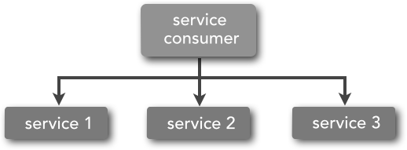

# Introduce to architecture <!-- omit in toc -->

- [What is architecture](#what-is-architecture)
- [Common Architectures](#common-architectures)
	- [N-layer](#n-layer)
	- [Micro Services](#micro-services)
		- [Example from Uber](#example-from-uber)
		- [Definition](#definition)
	- [Service-Oriented Architecture](#service-oriented-architecture)
		- [opinion 1:  "SOA is about how to achieve integration often to aging complex back end systems in order to expose services."](#opinion-1-%22soa-is-about-how-to-achieve-integration-often-to-aging-complex-back-end-systems-in-order-to-expose-services%22)
			- [Background](#background)
			- [Service Orchestration and Choreography](#service-orchestration-and-choreography)
				- [Orchestration(centralized conductor)](#orchestrationcentralized-conductor)
				- [Choreography(inter-service communication)](#choreographyinter-service-communication)
				- [SOA relies on both service orchestration and service choreography to process business requests.](#soa-relies-on-both-service-orchestration-and-service-choreography-to-process-business-requests)
			- [How integration hub works](#how-integration-hub-works)
				- [mediation and routing](#mediation-and-routing)
				- [message enhancement](#message-enhancement)
				- [message transformation](#message-transformation)
				- [protocol transformation](#protocol-transformation)
		- [opinion 2:  "SOA is about re-factoring your IT landscape into components that better align with the business needs and expose the services that it requires."](#opinion-2-%22soa-is-about-re-factoring-your-it-landscape-into-components-that-better-align-with-the-business-needs-and-expose-the-services-that-it-requires%22)
		- [SOA example](#soa-example)
		- [Compare SOA with microservices](#compare-soa-with-microservices)
- [Summary](#summary)
- [Reference](#reference)

## What is architecture

People in the software world have long argued about a definition of architecture. For some it's something like the fundamental organization of a system, or the way the highest level components are wired together. A second common style of definition for architecture is that it it's "the design decisions that need to be made early in a project"

> “Architecture is about the important stuff. Whatever that is.”  
> -- Ralph Johnson & Martin Fowler

## Common Architectures

- N-layer
- Service-Oriented Architecture
- Micro Services
- Micro Frontends
- Serverless Architectures
- Event-driven architecture
- Web-Queue-Worker architecture

### N-layer

Advantage：reduce the scope of my attention

As an application grows, each layer can get sufficiently complex on its own that you need to modularize further.

### Micro Services

#### Example from Uber

after broke monolith into micro services

#### Definition

> In short, the microservice architectural style is an approach to developing a single application as a suite of small services, each running in its own process and ***communicating with lightweight mechanisms***, often an HTTP resource API. These services are ***built around business capabilities*** and ***independently deployable*** by fully automated deployment machinery. There is a bare minimum of centralized management of these services, which may be written in different programming languages and use different data storage technologies.  
>  
> -- James Lewis and Martin Fowler (2014)

### Service-Oriented Architecture

Service-oriented architecture (SOA) was an overused term and has meant different things to different people.

But as a common denominator, SOA means that you structure your application by decomposing it into multiple services (most commonly as HTTP services) that can be classified as different types like subsystems or tiers.

#### opinion 1:  "SOA is about how to achieve integration often to aging complex back end systems in order to expose services."

##### Background

Before SOA emerged in the late 1990s, connecting an application to data or functionality housed in another system required complex point-to-point integration—integration that developers had to recreate, in part or whole, for each new development project. Exposing those functions through SOA eliminates the need to recreate the deep integration every time.

##### Service Orchestration and Choreography

###### Orchestration(centralized conductor)

###### Choreography(inter-service communication)

###### SOA relies on both service orchestration and service choreography to process business requests.

##### How integration hub works

###### mediation and routing

###### message enhancement

###### message transformation

###### protocol transformation

#### opinion 2:  "SOA is about re-factoring your IT landscape into components that better align with the business needs and expose the services that it requires."

In this case, SOA is focus on realignement to the business needs. The servcie component looks more like applications, and we may consider microservices as "more granular SOA", or even "SOA done right".

#### SOA example

By 2010, SOA implementations were going full steam at leading companies in virtually every industry. For example:

- Delaware Electric turned to SOA to integrate systems that previously did not talk to each other, resulting in development efficiencies that helped the organization stay solvent during a five-year, state-mandated freeze on electric rates.
- Cisco adopted SOA to make sure its product ordering experience was consistent across all products and channels by exposing ordering processes as services that Cisco’s divisions, acquisitions, and business partners could incorporate into their web sites.
- Independence Blue Cross (IBC) of Philadelphia implemented an SOA to ensure that the different constituents dealing with patient data—IBC customer service agents, physicians’ offices, IBC web site users—were working with the same data source (a ‘single version of the truth’).
You can read more details about these and several other SOA use cases in Service Oriented Architecture for Dummies (available at no charge, no registration required).

#### Compare SOA with microservices

| feature | soa | microservices |
| --- | --- | --- |
| Application Scope | SOA is well-suited for large, complex, enterprise-wide systems that require integration with many heterogeneous applications and services.  It is also well-suited for applications that have many shared components, particularly components that are shared across the enterprise.  As such, SOA tends to be a good fit for large insurance companies due to the heterogeneous systems environment and the sharing of common services—customer, claim, policy, etc.—across multiple applications and systems.  | The microservices pattern is better suited for smaller, well partitioned web-based systems rather than large-scale enterprise wide systems.  Other examples of applications that are well-suited for the microservices architecture pattern are ones that have few shared components and ones that can be broken down into very small discrete operations. |
| Heterogeneous Interoperability | SOA support protocol-agnostic heterogeneous interoperability, the service consumer is ignorant not only of the implementation of the service, but also of the protocol the service is listening on.   **Suggest**  If you find yourself in a heterogeneous environment where you need to integrate several different types of systems or services using different protocols, chances are that you will need to look toward SOA rather than microservices. | microservices architecture supports protocol-aware heterogeneous interoperability.  The protocol between the service consumer and service must be the same because there is no central middleware component to transform the protocol.   **Suggest**  If all of your services can be exposed and accessed through the same remote-access protocol (e.g., REST), then microservices can be the right choice. |
| Fundamental Design Principle | SOA is a ***share-as-much-as-possible*** architecture pattern that places heavy emphasis on abstraction and business functionality reuse | microservices architecture is a ***share-as-little-as-possible*** architecture pattern that places a heavy emphasis on the concept of a bounded context |

## Summary

像GOF设计模式一样，在架构层面，大家面对的问题大部分也是一样的，前辈们已经总结了很多最佳实践，或者说pattern，只不过这些pattern的level更高一些。作为开发人员，我们要知道有哪些常用的模式，适用的场景是什么，把他们放到自己的技能工具箱中以备不时之需。如果我们的工具箱中之后少数几个工具，就有可能犯“手里有个锤子，看什么都是钉子”的错误，殊不知这世界上还有更适合的“锤子”可以解决那个“钉子”。

## Reference

- [Martin Fowler: PresentationDomainDataLayering](https://martinfowler.com/bliki/PresentationDomainDataLayering.html)
- [Cam Jackson: Micro Frontends](https://martinfowler.com/articles/micro-frontends.html)
- [Web-Queue-Worker architecture style](https://docs.microsoft.com/en-us/azure/architecture/guide/architecture-styles/web-queue-worker)
- [Microsoft: Event-driven architecture style](https://docs.microsoft.com/en-us/azure/architecture/guide/architecture-styles/event-driven)
- [Mike Robe: Serverless Architectures](https://martinfowler.com/articles/serverless.html)
- [Nginx: introduction to microservices](https://www.nginx.com/blog/introduction-to-microservices/)
- [IBM: SOA](https://www.ibm.com/cloud/learn/soa)
- [IBM: ESB](https://www.ibm.com/cloud/learn/esb)
- [SOA vs. microservices, IBM talk on Youtube](https://www.youtube.com/watch?v=YTdTKsm9n14&feature=emb_logo)
- [《Microservices vs. Service-Oriented Architecture》by Mark Richards](https://www.nginx.com/resources/library/microservices-vs-soa/)
