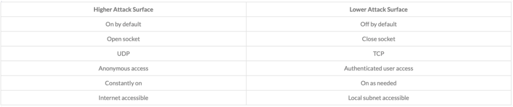
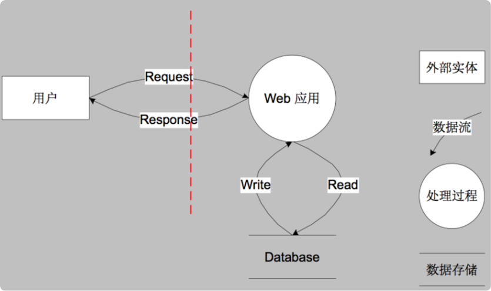
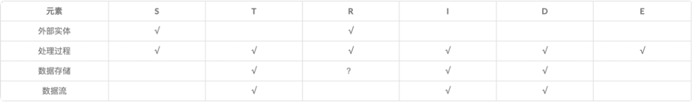
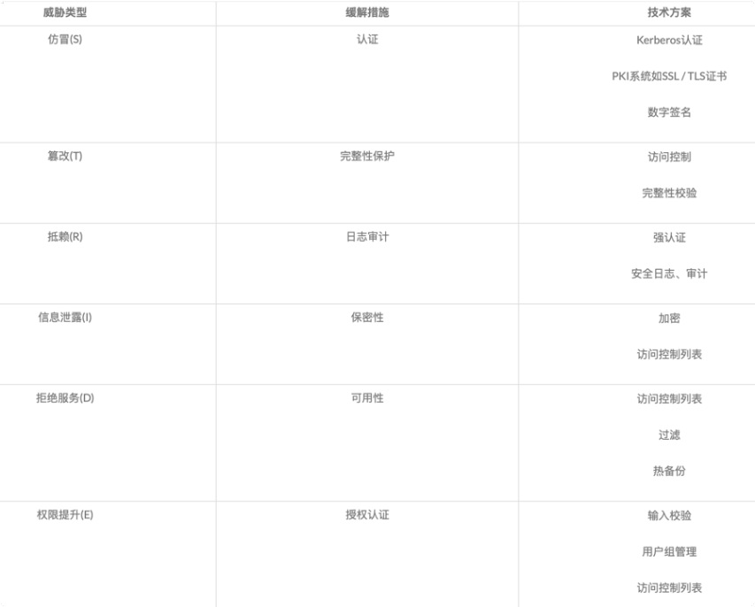

# 系统安全概要设计

系统安全是一个复杂问题，涉及系统各个层级，安全工作充斥在软件开发、运维的各个阶段。应对这样的复杂问题，如何做到考虑有无遗漏、方案设计合理有效，是个值得思考的问题。

本文主要包含三部分内容：
1. 安全核心原则，主要讲解实现系统安全等基本原则，适用与系统的各个层级，属于指导思想；
2. STRIDE威胁建模方法，主要讲解利用固定套路分析、解决系统研发方面的安全问题，属于方法论；
3. 具体实现部分，依次讲解接口、web、内部系统、数据存储、服务器等方面的安全设计与实现

## 核心原则
### Attack Surface Reduction：攻击面最小化
攻击面是指程序任何能被用户或者其它程序所访问到的部分，这些暴露给用户的地方往往也是最可能被恶意攻击者攻击的地方。

常见的攻击面分析技巧如下表:


### Basic Privacy: 基本隐私

### Least Privilege: 权限最小化

### Secure Defaults: 默认安全
默认安全配置在客户熟悉安全配置选项之前不仅有利于更好的帮助客户掌握安全配置经验，同时也可以确保应用程序初始状态下处于较安全状态。
而客户可根据实际使用情况而决定应用程序安全与隐私的等级水平是否降低。

### Defense in Depth：纵深防御
纵深防御包含两层含义：首先，要在各个不同层面、不同方面实施安全方案，避免出现疏漏，不同安全方案之间需要相互配合，构成一个整体；
其次，要在正确的地方做正确的事情，即：在解决根本问题的地方实施针对性的安全方案。

纵深防御并不是同一个安全方案要做两遍或多遍，而是要从不同的层面、不同的角度对系统做出整体的解决方案。

举例:

* 针对XSS的防护，除了要对用户输入的特殊符号进行过滤，还要区分是否是富文本进而进行相应编码操作，在输入时过滤的同时在输出时也进行过滤操作。
* 即使做了十足的过滤、编码等安全防护，为了更一步确保缓解XSS攻击，Web站点也可以对Cookie启用HTTP-Only属性，确保即使发生XSS攻击，也可以阻止通过脚本访问Cookie的操作。

### Threat Modeling：威胁建模
威胁建模是一种分析应用程序威胁的过程和方法。这里的威胁是指恶意用户可能会试图利用以破坏系统，和我们常说的漏洞并不相同。漏洞是一个特定的可以被利用的威胁，如缓冲区溢出、sql注入等。

威胁建模允许安全设计人员尽量识别潜在的安全问题并实施相应缓解措施。
在设计阶段把潜在的威胁发现有助于威胁的全面和更有效的解决，同时也有助于降低开发和后期维护的成本。威胁建模的一般流程如下:
* 了解设计详情
* 使用成熟的威胁建模方法分析当前设计潜在的安全问题
* 提出安全建议及对潜在威胁的缓解措施
* 对安全设计进行验证并对整个设计方案进行回顾并再次确认

业界微软提出过一种名为STRIDE威胁建模方法。

## STRIDE威胁建模方法

### STRIDE介绍
STRIDE威胁建模是由微软提出的一种威胁建模方法，该方法将威胁类型分为Spoofing（仿冒）、Tampering（篡改）、Repudiation（抵赖）、
Information Disclosure（信息泄漏）、Denial of Service（拒绝服务）和 Elevation of Privilege（权限提升）。
这六种威胁的首字母缩写即是STRIDE，STRIDE威胁模型几乎可以涵盖目前绝大部分安全问题。此外，STRIDE威胁建模方法有着详细的流程和方法。

### 威胁建模流程
STRIDE威胁建模的一般流程如下:
* 绘制数据流图
* 识别威胁
* 提出缓解措施
* 安全验证

#### 数据流图
数据流图(Data Flow Diagrams)包含外部实体(External Entity)、处理过程(Process)、数据流(Data Flow)、数据存储(Data Store)，
安全人员与系统架构师及设计人员沟通，了解设计详情并画出数据流图后还需要标注信任边界（Trust Boundary），针对简单的Web应用的数据流图如下:


#### 识别威胁
STRIDE威胁建模方法已经明确了每个数据流图元素具有不同的威胁，其中外部实体只有仿冒（S）、抵赖（R）威胁，数据流只有篡改（T）、信息泄露（I）、拒绝服务（D）威胁，
处理过程有所有六种（STRIDE）威胁，存储过程有篡改（T）、信息泄露（I）、拒绝服务（D）威胁，但如果是日志类型存储则还有抵赖（R）威胁。
具体可以对照如下表格进行威胁识别:


#### 缓解措施
据不同的数据流图元素及威胁，相应的缓解措施也不相同。如上文数据流图中外部实体用户的仿冒威胁，其缓解措施简单来说就是对用户身份进行认证。
对于一个Web应用来说，缓解仿冒威胁不仅需要较强的认证机制，还需要防止恶意攻击者用暴力破解、口令猜测等方法绕过认证从而造成仿冒用户的威胁。
比如设计用户仿冒威胁的缓解措施，详细措施可能如下:

* 对用户访问进行帐号密码、证书等身份认证;
* 用户帐号密码认证过程中，如果出现三次密码错误，则增加验证码机制。输入验证码且正确再进行身份认证;
* 当用户认证5次后仍然验证失败，则在30分钟内禁止该帐号登录;
* 用户密码必须包含数字、字母及特殊字符，且长度在8位以上，如果业务安全需要则增加密码过期机制，每隔6个月提醒用户修改密码;

在提出缓解措施时，有的时候不仅要考虑安全问题，同时也要考虑软件的易用性，所以不同的威胁，不同的应用场景。
其缓解措施也要随之而改变以提高应用安全的同时也能给用户带来较好的交互体验。



#### 安全验证
在威胁建模完成后，需要对整个过程进行回顾，不仅要确认缓解措施是否能够真正缓解潜在威胁，同时验证数据流图是否符合设计，代码实现是否符合预期设计，
所有的威胁是否都有相应的缓解措施。最后将威胁建模报告留存档案，作为后续迭代开发、增量开发时威胁建模的参考依据。


## 接口安全
接口是系统提供给用户的唯一入口，无论APP还是WEB都是通过接口使用系统功能，解决了接口的安全问题就解决了系统大部分的安全问题。   
青书学堂各个系统提供的接口可以分为`内网接口`和`外网接口`，`内网接口`外网不能访问，我们暂且认为内网环境是安全的，所以此处只讨论`外网接口`的安全性问题。

### 潜在安全问题
根据STRIDE模型进行分析，可以总结出以下几类潜在威胁：
* AuthFree接口
* 弱口令
* 爆破破解密码
* 敏感信息泄漏  
  `比如短信验证码登陆时，接口不能返回说当前手机号尚未注册，否则会暴露出青书学堂所有用户的手机号；  
  再比如账号密码登陆时，不应准确提示'账号不存在'或提示'密码错误'，而应笼统的提示账号或密码错误`
* 越权攻击（水平越权、垂直越权）
* 重放攻击
* 中间人攻击
* 接口恶意频繁调用

### 方案
* 限制AuthFree接口
* 认证&授权
* 禁用弱口令
* 接口幂等性设计
* 接口入参校验  
* 防恶意频繁调用
* HTTPS

### 限制AuthFree接口
AuthFree接口即不需要认证&授权的接口，比如任何用户都可以访问青书学堂主页、学校主页，不需要任何授权，这类接口应该严格管控，具体原则：

* 明确划分哪些接口是不需要认证授权就可以访问的，尽量缩小这个范围
* AuthFree接口不能涉及敏感数据，如学生名单/学生成绩等
* 提供给外部系统调用的接口（比如与学校对接成绩），不能够AuthFree

### 认证&授权
青书学堂公开接口的用户可以分为系统内用户和系统外用户两类，针对这两类接口，其认证授权策略也有不同，具体思路如下：

#### 1、JWT Token
提供给青书学堂用户的接口，需要先通过登陆接口获取token后使用。token为JWT格式，其中payload内容大致如下：
```json5
{
  "client": "APP",
  "uId": 12312,
  "anonymous": false,
  "roles": [
    {
      "org": 12312,   // 用户所属组织，比如某学校、教师平台、云享课
      "subOrg": 123,  // 用户所属子组织，如某函授站、某个人教师平台、某云享课站点
      "uId": 1231424, // 用户在所属组织中的ID，如studentId, teacherId
      "roles": [2,4], // 用户角色
      "modules": [12,3,34,4,645,876] // 用户有权访问的功能模块
    }
  ]
}
```

##### 校验
1. 不同client的token相互独立，`APP`类型的token不能调用`WEB`接口，反之亦然
2. 不同环境的token相互独立，不能互用
3. server根据token中角色判断其权限范围，防止越权访问，比如A学校老师操作B学校资源、教学老师访问教务老师接口等

#### 2、SIGN
提供给第三方用户的接口，一律需要使用sign机制实现认证授权，具体实现思路为：  
1. 为每个第三方分配唯一的`APPID`和`APPSECRET`
2. server设置每个`APPID`允许调用的接口 
3. 第三方调用接口时，使用`APPSECRET`对请求内容进行`HmacSHA256`签名，待签名内容除业务参数外，还需带有`APPID`, `timestamp`

```http request
// 请求示例
GET https://api.qingshuxuetnag.com/open/v1/order/search?appId=2k320s0s&payStatus=1&timestamp=122392839239&userId=112&sign=lsakfjq4jr234j52134i51p24121
```
```JAVA
class SignHelper{
    
    public String sign(Request request){
      // 所有请求参数按字母顺序排列生成待签名字符串，如：
      // appId=2k320s0s&payStatus=1&timestamp=122392839239&userId=112
      String text = request.getTextToSign();
      return HMAC256(text, getAppSecret());
    }
}
```
##### 校验
```java
class RequestAuthFilter(){
  
    public boolean auth(Request request){
        if (!isSignValid(request)){
            return false;
        }

        List<Permission> permissions = getPermissionByAppId(request.getAppId());
        return hasPermission(request.getPath(), permissions);
    }
}
```

### 禁用弱口令
* 使用弱口令登陆时，server生成一个只能用于`修改密码`、`绑定手机号`、`获取个人信息`的token
* 用户登陆后，根据`获取个人信息`接口查询用户是否需要绑定手机号/修改密码，优先绑定手机号
* 修改密码仅支持手机号验证码方式

### 接口幂等性设计
防止重放攻击，主要是新增数据类接口，比如：下单、创建用户、上传学习记录、交卷等接口

### 接口入参校验
* 参数格式校验：如字段是否为空、手机号格式、身份证格式等
* 参数业务校验：如ENUM是否合理、指定资源是否存在、是否违反业务规则等

### 防恶意频繁调用
在接口破坏力程度上，我们可以把接口分为以下几类：
1. AuthFree类接口
2. 查询类接口
3. 数据管理类接口
   `举例：注册用户、下单、点赞、发帖、修改成绩等接口`
4. 三方服务调用相关接口
   `举例：发送短息、人脸识别、CDN上传等`
5. 账号安全相关接口  
    `举例：登陆、更新密码、找回密码、身份信息绑定等`

以上五类，对恶意调用的容忍度应当是越来越低的。在这个原则的指导下，我们可以采用`IP/用户限流`、`业务安全检查`、`IP BLOCK`三种方案相结合的方式来应对接口恶意调用，具体如下：

#### IP/用户限流
在NGINX对几类接口配置兜底限流方案，在较粗粒度上进行较宽松的限流
```
// AuthFree接口
limit_req_zone $binary_remote_addr zone=per_ip_50rps:50m rate=50r/s;
limit_req_zone $binary_remote_addr zone=per_ip_10rps:50m rate=10r/s;

// 查询类接口
limit_req_zone $cookie_token zone=peruser_20rps:200m rate=20r/s;
limit_req_zone $http_token zone=peruser_20rps:200m rate=20r/s;

// 数据管理类接口
limit_req_zone $cookie_token zone=peruser_2rps:100m rate=2r/s;
limit_req_zone $http_token zone=peruser_2rps:100m rate=2r/s;

// 三方服务调用类接口
limit_req_zone $cookie_token zone=peruser_30rpm:50m rate=30r/m;
limit_req_zone $http_token zone=peruser_30rpm:50m rate=30r/m;

// 账号安全相关接口
limit_req_zone $cookie_token zone=peruser_10rpm:50m rate=10r/m;
limit_req_zone $http_token zone=peruser_10rpm:50m rate=10r/m;
```

#### 业务安全检查
针对安全性要求更高的接口，比如三方服务调用相关接口和账号安全类接口，接口设计时，引入更多验证参数，同时结合业务场景进行精准限流，具体措施有：
* 要求必须输入图片验证码  
  `适用场景举例：发送短息、上传CDN(调用超过阈值时）`
* 要求必须输入短信验证码  
  `适用场景举例：注册、绑定手机号、注销账号、找回密码、修改密码等`
* 设置单用户连续错误次数阈值  
  `适用场景举例：输入图片验证码错误、输入短信验证码错误、输入账号密码错误等`
* 限制单用户调用频率，超过阈值时提示其输入验证码证明不是机器人  
  `适用场景举例：频繁调用上传CDN接口、频繁调用人脸识别`
  
#### IP BLOCK
防止长时间的持续恶意调用，比如持续以低于上文限流阈值的频率请求接口  
实现：在NGINX主机部署shell脚本监控access log，当某IP请求某接口频率超过阈值时，自动将该IP加入deny list.


### HTTPS
防止中间人攻击


## WEB前端安全
### 潜在问题
* JS注入
* CSRF
* 文件上传攻击
* 前端存储敏感信息

### 方案
* 使用HTTP security header
* 表单、AJAX提交执行CSRF安全验证
* 代码不硬编码敏感信息
* 代码不做加密操作
* cookie/storage不存明文敏感信息
* 使用security cookie


## 内部系统安全
### 潜在风险
* OP系统账号被盗用
* build系统账号被盗用

### 方案
* OP登陆改为手机号验证码方式
* build系统改为局域网部署，外部使用VPN访问


## 数据存储安全
* 数据服务器全部内网部署
* 按最小特权原则设定访问账号权限
* 数据库replication  
  `主要解决磁盘损坏问题`
* 数据库每日自动备份  
  `建立兜底的safe point`
* 记录核心数据修改/删除  
  `用于责任人追溯和数据恢复`


## 应用服务器安全
* 除网关外，所有主机部署在内网
* 公网主机防火墙，只开放需要的端口
* 内网主机分环境隔离，生产/测试环境主机不能相互访问、使用独立对外VPN
* 所有主机远程登陆使用证书方式

