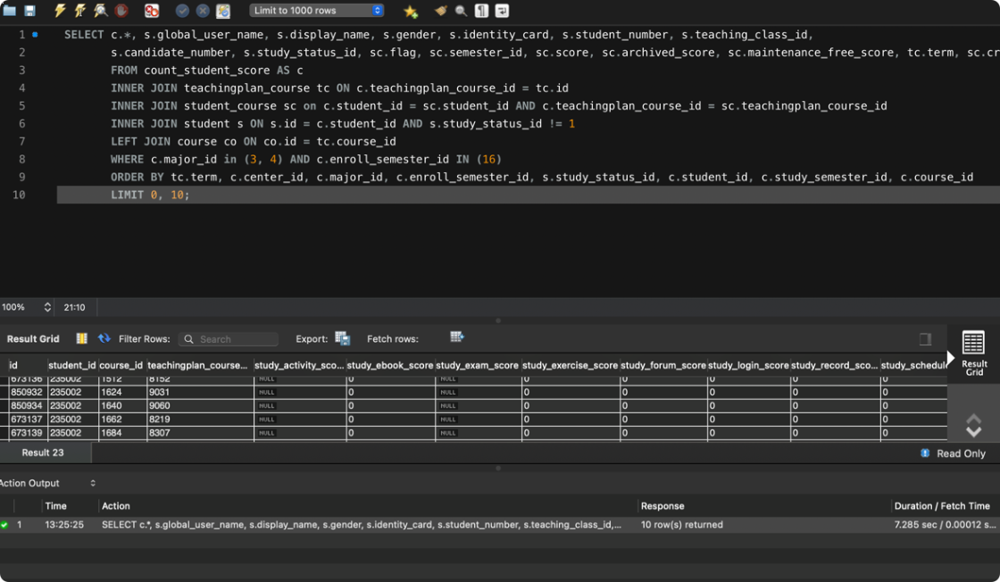
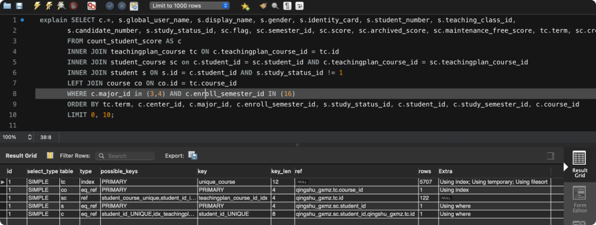
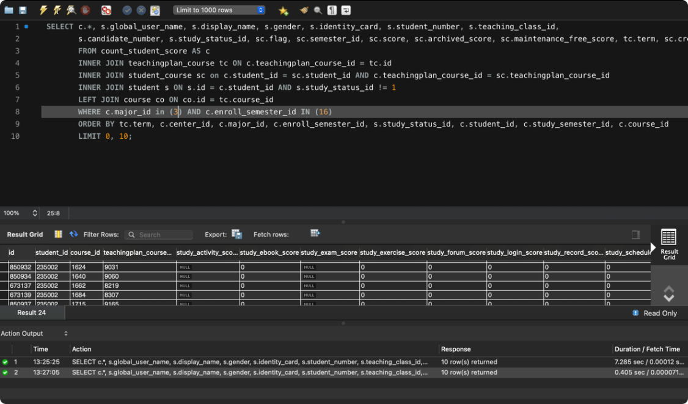
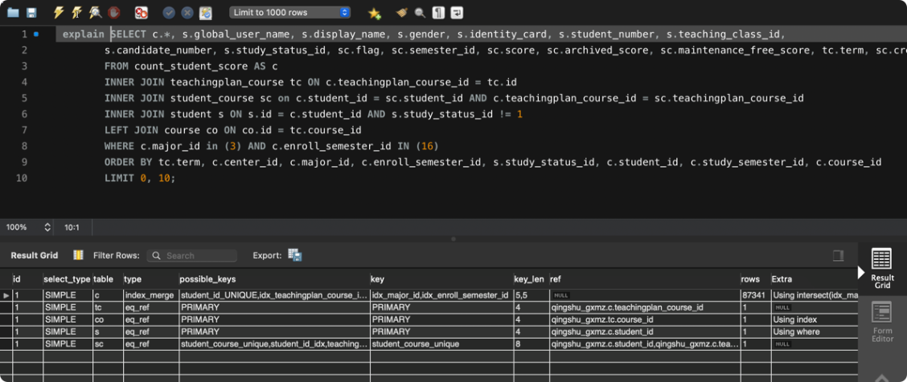
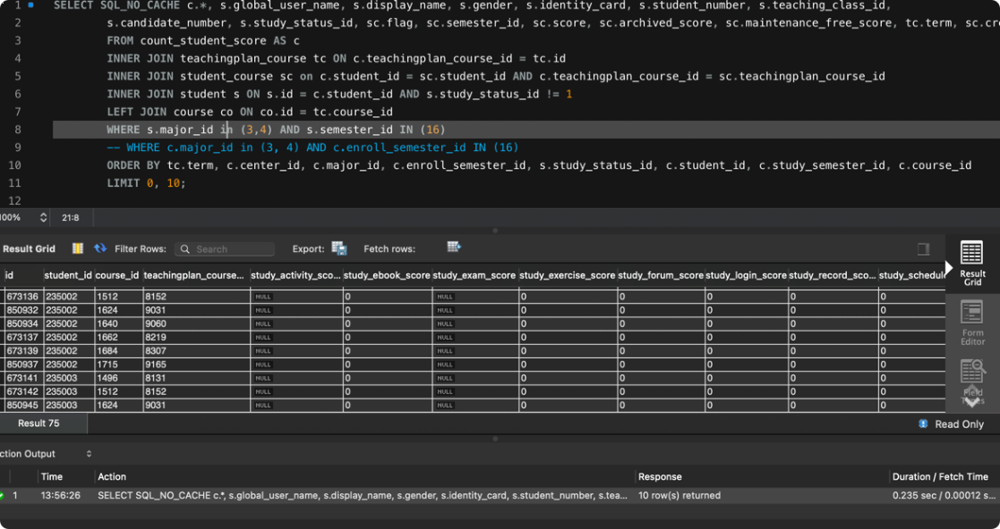
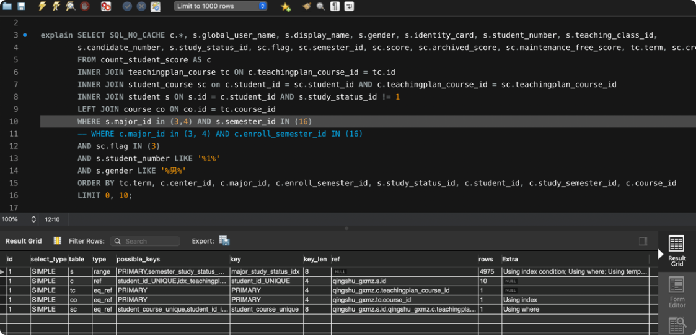
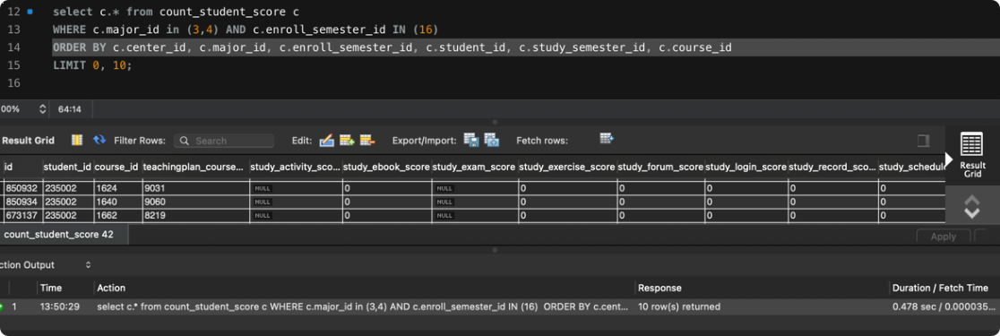
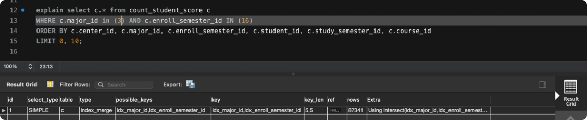

# Mysql in Action

## SELECT语句

### 不走索引的情况

### 扫描范围
#### distinct、SQL_CALC_FOUND_ROWS、order by、group by

### join 驱动表

- explain每一列的含义

- 为什么要避免join，什么情况下做join是可以的

- order by是怎么工作的

- group by是怎么工作的


## INSERT/UPDATE/DELETE

### 加锁情况分析
```sql
    student {
        id int pk,
        name varchar(50) unique index,
        age int index,
        nation varchar(10),
        ...
    }
```

- `select * from student where id = 1;`
没有锁

- `insert into student values(100, "hhah", 18, "汉族");`
锁 unq_name[hhah] 、primary[100]

- `update student set name = 'new name' where name = 'old name';`
  锁 unq_name['old name'] 、unq_name['new name']、及关联primary

- `update student set age = 18 where nation = 'not exists';`
锁 primairy[all]

- `update student set nation = 'test' where age = 18;`
* 如果18存在：idx_age[18]；
* 如果18不存在：没有锁
where指定唯一索引也是一样

- `update student set name = 'tset' where age = 18;`
name索引加间隙锁

- `insert into student(id, name, age, nation) select id, name, age, nation from tmp;`
tmp表锁

- `update student s inner join tmp on s.name = tmp.name set s.nation = 'test';`
tmp表锁，student行锁和间隙锁

- `update student s inner join tmp on s.nation = tmp.nation set s.age = 18;`
tmp表锁，student表锁（因为student.nation没有索引）

- update a join b

- insert into select from


总结：加锁是为了防止数据不一致（比如某些后执行的事务先提交，会导致binlog放到replica上跑之后的结果和master库不一致）  
我总结的加锁规则里面，包含了两个“原则”、两个“优化”和一个“bug”。
* 原则 1：加锁的基本单位是 next-key lock，next-key lock 是前开后闭区间。
* 原则 2：查找过程中访问到的对象才会加锁。
* 优化 1：索引上的等值查询，给唯一索引加锁的时候，next-key lock 退化为行锁。
* 优化 2：索引上的等值查询，向右遍历时且最后一个值不满足等值条件的时候，next-key lock 退化为间隙锁。
* 一个 bug：唯一索引上的范围查询会访问到不满足条件的第一个值为止。


- What is the difference between Primary Key and Unique Key?  
Answer : Both Primary and Unique Key is implemented for Uniqueness of the column. Primary Key creates a clustered index of column where as an Unique creates unclustered index of column. Moreover, Primary Key doesn’t allow NULL value, however Unique Key does allows one NULL value.

- redo log & binlog

- MVCC是如何实现的

- InnoDB 索引模型

- mysql kill不掉的语句

## 运维

### 连接数高
### 内存高
### 活动链接数高
### CPU高
### IO高

SELECT query, exec_count, total_latency, max_latency FROM sys.statements_with_runtimes_in_95th_percentile;

SELECT LEFT(DIGEST_TEXT, 64) AS DIGEST_TEXT, COUNT_STAR, SUM_TIMER_WAIT, MAX_TIMER_WAIT
FROM performance_schema.events_statements_summary_by_digest
ORDER BY MAX_TIMER_WAIT DESC
LIMIT 10;

SELECT *
FROM sys.metrics
WHERE Variable_name IN ('log_lsn_current', 'log_lsn_last_checkpoint');

` SELECT c.*, s.global_user_name, s.display_name, s.gender, s.identity_card, s.student_number, s.teaching_class_id,
s.candidate_number, s.study_status_id, sc.flag, sc.semester_id, sc.score, sc.archived_score, sc.maintenance_free_score, tc.term, sc.create_time AS select_course_time
FROM count_student_score AS c
INNER JOIN teachingplan_course tc ON c.teachingplan_course_id = tc.id
INNER JOIN student_course sc on c.student_id = sc.student_id AND c.teachingplan_course_id = sc.teachingplan_course_id
INNER JOIN student s ON s.id = c.student_id AND s.study_status_id != 1
LEFT JOIN course co ON co.id = tc.course_id
WHERE c.major_id in (3, 4) AND c.enroll_semester_id IN (16)
ORDER BY tc.term, c.center_id, c.major_id, c.enroll_semester_id, s.study_status_id, c.student_id, c.study_semester_id, c.course_id
LIMIT 0, 10;`











`select c.* from count_student_score c
WHERE c.major_id in (3,4) AND c.enroll_semester_id IN (16)
ORDER BY c.center_id, c.major_id, c.enroll_semester_id, c.student_id, c.study_semester_id, c.course_id
LIMIT 0, 10;`




### mysql常用优化设置
innodb_buffer_pool_size         {DBInstanceClassMemory*3/4}
innodb_buffer_pool_instances    {DBInstanceClassMemory*3/4/1610612736}

innodb_log_file_size            1G, SSD suggest use max 
innodb_log_files_in_group       2
innodb_io_capacity              suggest use IOPS of disk
innodb_max_dirty_pages_pct      75%, 脏页比例大于此值时，按innodb_io_capacity速度刷脏页；小于时，按比例速度刷
innodb_flush_neighbors          0, 刷脏页时，是否带上兄弟脏页, high iops disk suggest 0

open_files_limit                65535
innodb_open_files               20000, accord to tables on instances
innodb_file_per_table           Y
table_open_cache                {DBInstanceClassMemory/3435974}  // 32G->10000
table_open_cache_instances      16
table_definition_cache          20000, accord to tables on instances


innodb_thread_concurrency       0
thread_concurrency              remove it  
max_connections                 1000

query_cache_type                default 0, disable
query-cache-size                default 1048576 Byte

- 容灾
innodb_flush_log_at_trx_commit  1, flushed to disk at each transaction commit.
sync_binlog                     4, synchronized to disk after N binary log commit groups have been collected.